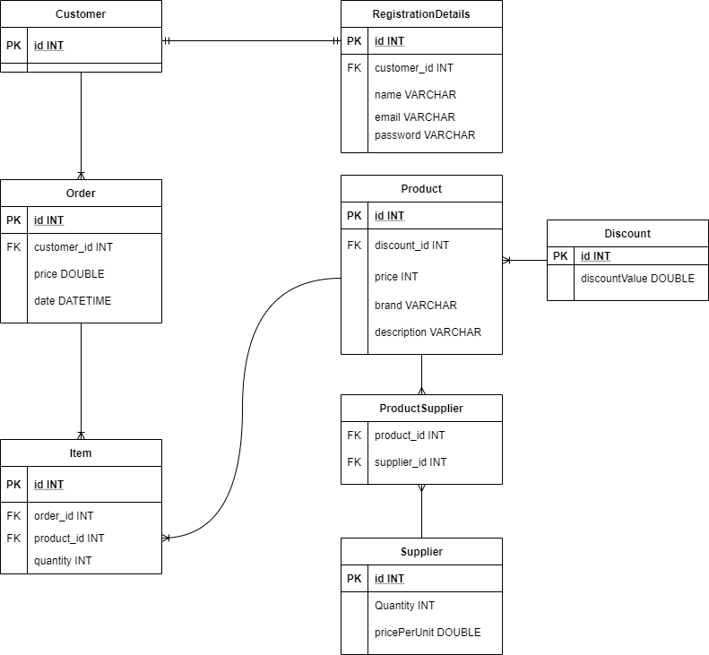

# WebShop
WebShop database schema which was used to create DbContext and Entities. 
Main functions of the model are:
1) Ability to apply one discount to many products that are in stock if discount value is the same. Removing the discount should not affect records of type product which are related to particular discount.
2) Product is linked with order items and suppliers. Each product may have different suppliers and vice versa.
3) Fully defined relationship between Customer-Order-OrderItem which results in cascade delete if one of the parent items is removed.
4) Required relationship between Customer and Customer registrations details.

